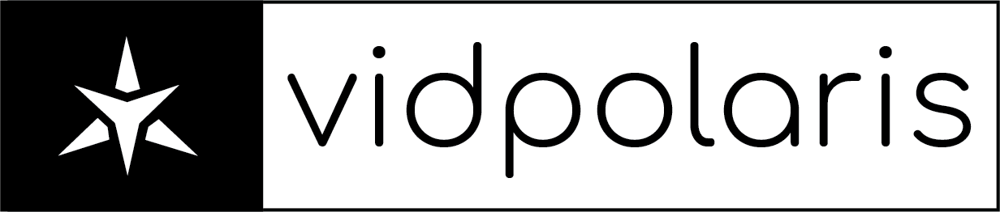

*Logo made by [njchaltry](https://github.com/njchaltry).*

An alternative client for YouTube made with NodeJS meant for privacy and simplicity.

**NOTE: This project is in no way affiliated with or endorsed by YouTube™ or Google™. YouTube is owned and operated by Google and I do not claim to own any of Google's properties. Use this at your own risk.**

## Features
- [Unlicensed, free to use code](./LICENSE).
- Small in size (Entire project in total with dependencies is ~20Mb)
- Multiple themes.
- [Easy-to-learn API](./docs/api/README.md)
- [Easy installation](./docs/startup/README.md)
- Heroku compatible ([See tutorial](./docs/heroku/README.md))

## Documentation 
For FAQs, [click here](./docs/help/README.md)!

For installation and requirement documentation, [click here](./docs/startup/README.md)!

To learn how to add your instance to the instances list, [click here](./docs/instances/README.md)

For API documentation, [click here](./docs/api/README.md)!

## Special Thanks
In no particular order, here are all of my thanks for keeping this project running!

- [Electrohaxz](http://electrohaxz.tk) for making this project possible. Without him, this project would be nowhere.
- [njchaltry](https://github.com/njchaltry) is another inspiration to keep this project going.
- [hazycora](https://hazycora.com) for proposing a better search system for music.
- Family and friends for encouraging me to continue this project.
- The awesome package writers who, without them, this project wouldn't even be alive right now.

## To Be Added
- Playlist support. *(semi-completed as of November 30, 2020)*
- Multiple comment sources (add Reddit and other sources)
- Custom theme writer.
- Better configuration for server owners.
- Write a version of the site to require no client side Javascript.
- Automatic updating/update alerts.