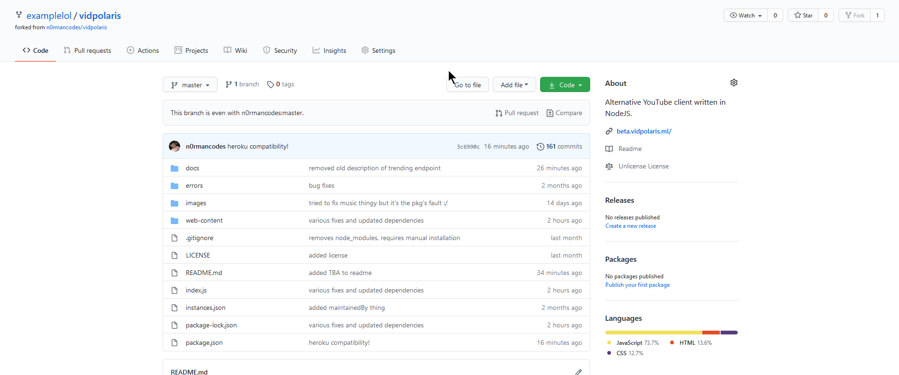
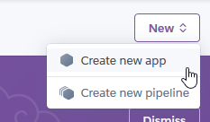
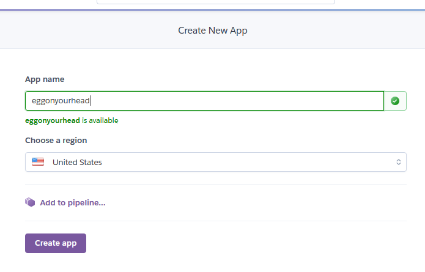
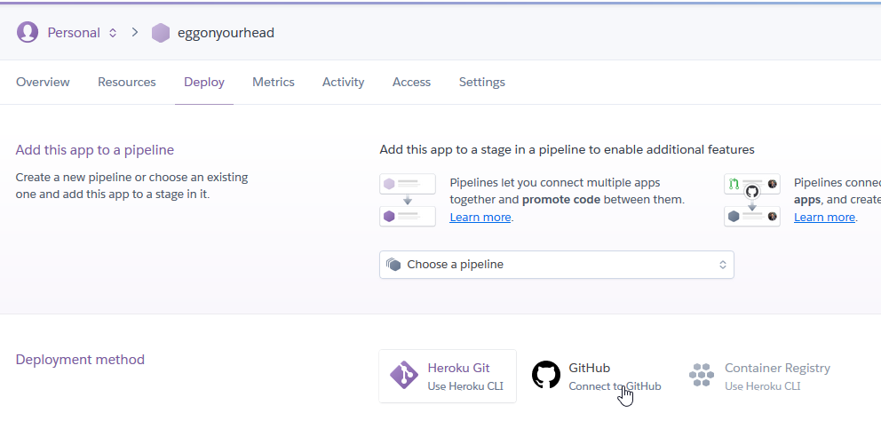
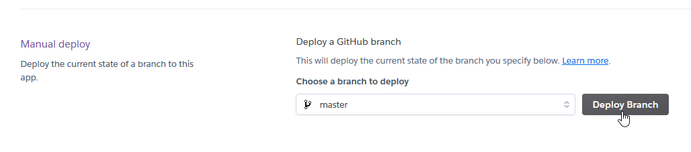
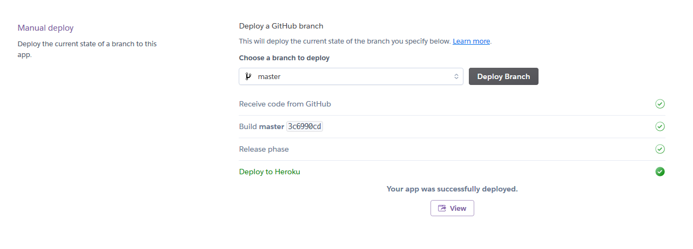

# Heroku Tutorial
If the other instances aren't doing it for you and don't have the time or resources to make your own instance.

## Note
If you haven't visited this instance within a few hours of deployment, it may take longer than usual to load due
to Heroku's "sleeping" deploys which deploy the server once it is contacted. If you are actively using it, the pages will 
load like normal after the first contact. If that is a dealbreaker, you may use [your own instance](../startup/README.md).

## Setup
For this you just need:
- A valid email to make 2 accounts on services, if you don't own accounts already

## Fork the repo
If you don't have an account, make an account on [Github](https://github.com/signup).

Then navigate to [this page](https://github.com/n0rmancodes/vidpolaris) in another tab.

In the upper right corner of the page there is a button called "Fork", click that!

Wait for the page to look similar to the image below.

## Set up the instance
Next if you don't have an account yet, make one on [Heroku](https://signup.heroku.com/).

Once your account is set up click on the button on the upper left corner that says "New" > "Create new app".

Name the app whatever you'd like and select the region on the list that is closest to you, then click "Create app".

## Deploy instance

Connect your Github account to the app follow the instructions like the images below.

Set the deployment method to Github.

Click "Connect to Github" when you are logged into Github. (Pop-ups should be enabled.)

Once it is connected, enable automatic deploys.

And finally click "Deploy Branch".

## Conclusion

If you see something similar to below, congrats! It worked!

You can now click "View" and your instance should be up and running!

[Example of Heroku version](https://vidpolaris-rw.herokuapp.com/)