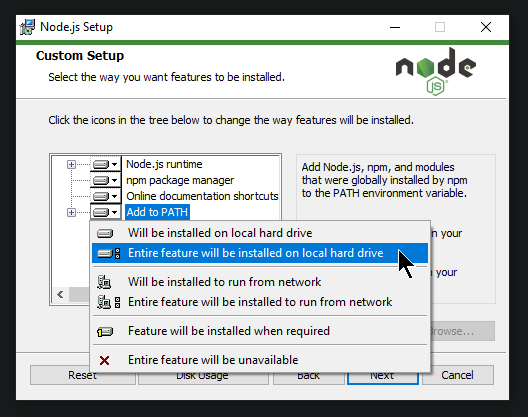
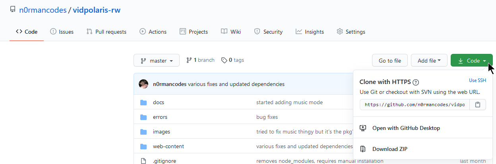
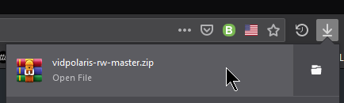
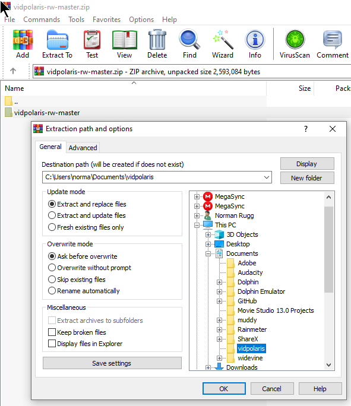
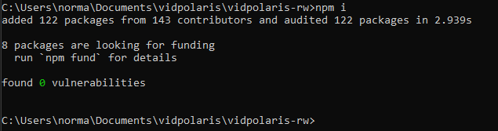

# Welcome
First off let me just say thank you for your interest in the project. I have a couple of notes 
you may want to read before you get started.

## Notes
- This may get your IP blocked from making queries to YouTube temporarily.

This is because VidPolaris is an unofficial client for YouTube, this is known as a 429 error and
is to prevent what VidPolaris is doing - scraping for data. Depending on your use case and/or
how many people are using the instance you set up, this could be either extremely rare or fairly 
common.

- Images and some details in this guide is taken in my copy of Windows 10.

If you do not have Windows 10, you may have to apply this to your operating system or enviorment.

## Setup

To get started you will need the following:
- An OS that supports a recent version of NodeJS.
- Fairly decent internet connection.

## Installing Programs
You can download NodeJS [at this link](https://nodejs.org/en/download/).

There are bundled together in the installer. Follow through the installation
process like normal **but be sure to add NodeJS to your PATH**.



Finish the installation and find the folder you would like to install 
VidPolaris into.

## Downloading VidPolaris
Depending on whether or not you have Git installed on your computer. If you don't, use "Browser Download" and ignore the Git Download section.

Otherwise, use "Browser Download".

### Browser Download
Navigate to [the main repo page](https://github.com/n0rmancodes/vidpolaris-rw) and click the green button. It should look similar to the image below.



Click the "Download ZIP" button in the dropdown.

Once it has downloaded, open it in your favorite ZIP extracting software and extract it into the 
folder you'd like to install VidPolaris in.





### Git Download
Open your terminal and navigate to the folder that you want VidPolaris to install in.
```
cd C:\Users\norma\Documents\vidpolaris
```
Then you can simply type the following command and move on.
```
git clone https://github.com/n0rmancodes/vidpolaris-rw
```

## Installing Dependencies
If you haven't already, navigate to the folder you want to install VidPolaris in your terminal 
and enter the single folder inside it, most likely named something like ``vidpolaris-rw`` or 
``vidpolaris-rw-master`` or a similar name.

Then in the terminal, run the following command.

```
npm install
```

This installs the programs needed to run VidPolaris that hasn't already been installed. When the
process is completed, it should look somewhat similar to the picture below.



You can also tell that the process is complete if there is now a folder in your directory named
``node_modules``.

## Start the server
You can now start the server using the following command in the terminal.

```
node index
```

That's all you have to do to begin the server. Now it *should* be useable without any issues such
as slow public servers or anything similar.

As long as the terminal is open and running the command you put in, VidPolaris would work.

Not sure what to do now? [More information can be found here](./etc/README.md)